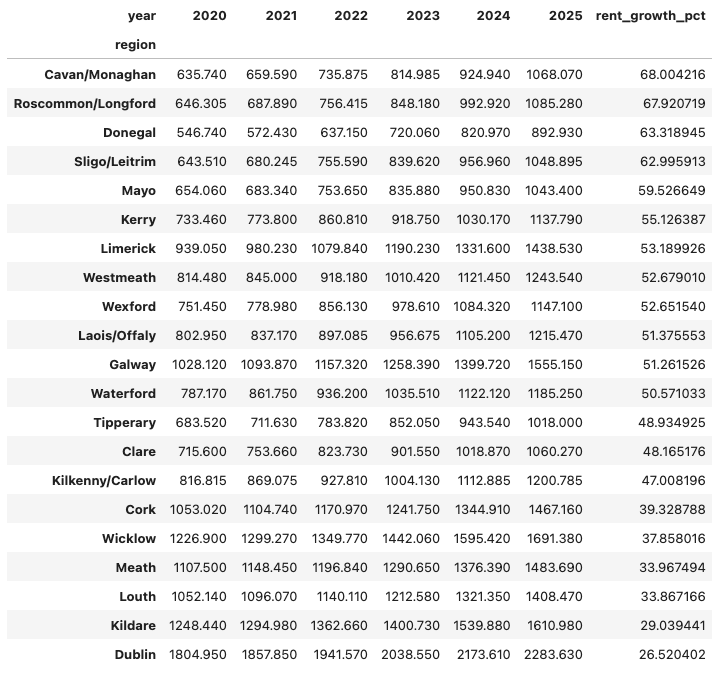

# 🇮🇪  Ireland Rent vs Crime Analysis (2020–2025)
## Project Overview

This project investigates the relationship between residential rent prices and recorded crime levels across Irish regions between 2020 and 2025.

The objective was to determine whether rising housing costs are associated with changes in crime patterns at a regional level.

This case study combines SQL data engineering and Python-based statistical analysis.

## Key Questions

- How have rents evolved across Irish regions since 2020?
- How has recorded crime changed over the same period?
- Is there a measurable statistical relationship between rent levels and crime?

## Data Sources

- Recorded Crime Incidents (Garda Divisions) - Data Gov IE
- County-Level Residential Rent Data - RTB/Kaggle

Crime data was aggregated from quarterly to yearly totals.
Rent data was harmonized to match Garda regional structures.

## Data Engineering Process (SQL)

1. Created structured database in MySQL
2. Built region mapping table to align Garda divisions with counties
3. Aggregated yearly crime totals by region
4. Consolidated multi-county rent regions
5. Created unified analytical dataset (rent_crime_analysis)

## Key Findings
### Rent Growth (2020–2025)

- Dublin experienced significant rent growth (+26.52%)
- Strong upward trend nationally
- Commuter regions also saw sustained increases

### Crime Growth (2020–2025)

- Crime levels remained relatively stable overall
- Some rural regions experienced decreases
- Urban centers showed moderate increases

(Insert crime growth screenshot here)

### Correlation Analysis

Pearson Correlation Coefficient:

0.67

This indicates a moderate positive relationship between rent levels and crime.

However, this likely reflects urban density effects rather than direct causation.

(Insert scatter plot image here)

## Interpretation

The results suggest that high-rent regions tend to also report higher crime volumes.

This pattern appears structural and driven by population concentration rather than evidence that rising rents directly cause crime.

Crime growth did not increase proportionally to rent growth.

## Tools Used

- MySQL
- Python (Pandas, Matplotlib, Seaborn)
- Data transformation & aggregation
- Correlation analysis
